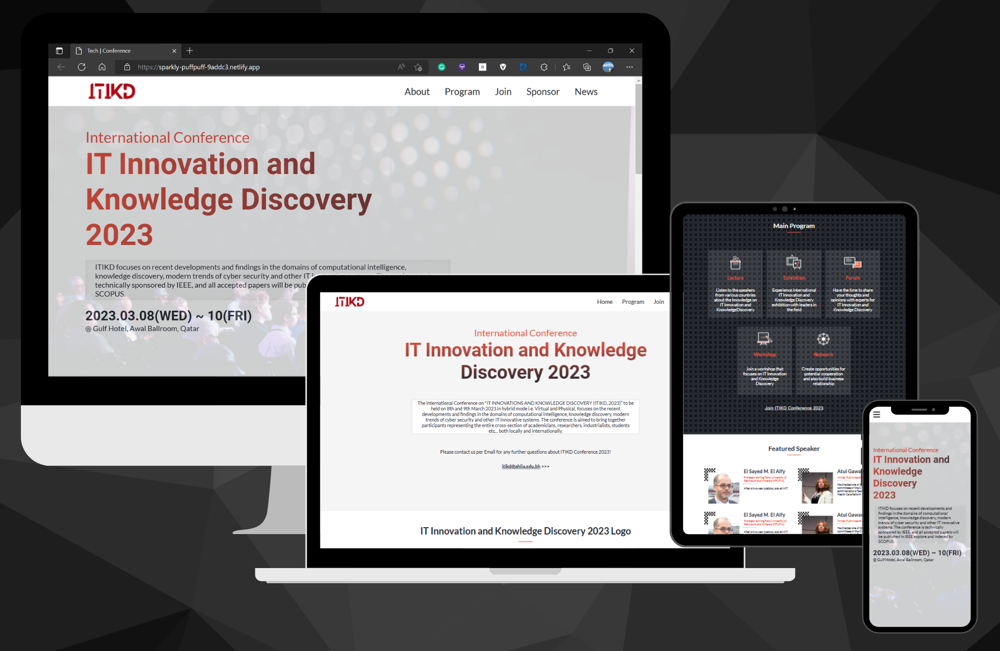

# ITIKD Conference

  <h3><b>Conference Website</b></h3>

# 📗Table of Contents

- [📖 About the Project](#about-project)
- [🛠 Built With](#built-with)
- [Tech Stack](#tech-stack)
- [Key Features](#key-features)
- [💻 Getting Started](#getting-started)
  - [Prerequisites](#prerequisites)
  - [Setup](#setup)
  - [Usage](#usage)
  - [Preview](#preview)
- [👥 Authors](#authors)
- [🔮 Future Features](#future-features)
- [🤝 Contributing](#contributing)
- [🙏 Acknowledgements](#acknowledgements)
- [📝 License](#license)

<!-- PROJECT DESCRIPTION -->

# 📖 Conference Website Setup 

This is a Conference Website, regarding ITIKD (IT Inovation and Knowledge Discovery) 2023. This site showcase the conference details, its past accomplishments and key guest, also sponsoring partners.

## 🛠 Built With 

### Tech Stack 

  
Client

  <ul>
    <li>HTML</li>
    <li>CSS</li>
    <li>JS</li>
    <li>.md</li>
  </ul>

<!-- Features -->

### Key Features 

- **An introduction section about conference**
- **Main Programs**
- **Feature Speakers**
- **About secton**
- **Sponsoring Partners**
- **Compatible in mobile, tab and desktop**

(<a href="#readme-top">back to top</a>)

## 💻 Getting Started 

### Prerequisites

In order to run this project you need:

A Browser

### Setup

Clone this repository to your desired folder:

[`dhirajsingha143/ITIKD-Conference-2023`](https://github.com/dhirajsingha143/ITIKD-Conference-2023.git)

### Install

Install this project with:
A commandline interface e.g Gitbash

### Usage

To run the project, execute the following command:
**Click on the live server button on your IDE**

(<a href="#readme-top">back to top</a>)

<!-- PREVIEW -->

### Preview

 

 

<a href="https://sparkly-puffpuff-9addc3.netlify.app/">Visit here</a> for Live version

<!-- AUTHORS -->

## 👥 Authors 

👤 **Dhiraj Singha**

- GitHub: [@dhirajsingha143](https://github.com/dhirajsingha143)
- Twitter: [@DhirajS89134](https://twitter.com/DhirajS89134)
- LinkedIn: [dhiraj-singha](https://www.linkedin.com/in/dhiraj-singha-b6871717a/)

(<a href="#readme-top">back to top</a>)

<!-- FUTURE FEATURES -->

### 🔮 Future Features 

- Page for details sheduled meetings.
- Page for ticket pricing.
- More Animations.

(<a href="#readme-top">back to top</a>)

<!-- CONTRIBUTING -->

## 🤝 Contributing 

Contributions, issues, and feature requests are welcome!

Feel free to check the [issues page](../../issues/).

(<a href="#readme-top">back to top</a>)

<!-- ACKNOWLEDGMENTS -->

## 🙏 Acknowledgments 

🙏 Acknowledgments
Give credit to everyone who inspired your codebase.

I appreciate Microverse for providing the learning resources for this exercise, and my coding partners for helping me out when I ran into problems.

(<a href="#readme-top">back to top</a>)

<!-- LICENSE -->

## 📝 License 

This project is [MIT](/MIT.md) licensed.

(<a href="#readme-top">back to top</a>)
